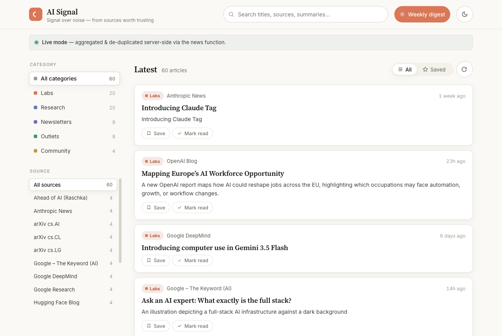

# AI Signal — a reliable AI news reader

[](https://ai-signal-news.netlify.app) &nbsp;[](https://www.anthropic.com) &nbsp;

> **Signal over noise** — primary-source AI news (the labs' own blogs, arXiv, and high-signal newsletters) in one clean feed, with an optional Claude-powered weekly digest.

🔗 **Live:** https://ai-signal-news.netlify.app



A single static page that aggregates verified, high-signal AI sources and surfaces a Claude-powered weekly digest. No framework, no build step — pure HTML/CSS/JS plus one dependency-free Netlify Function.

- **Live mode:** the page calls `/.netlify/functions/news`, which fetches every feed server-side, de-dupes, sorts, and returns JSON. The "Weekly digest" button calls the same function with `?digest=1` for a Claude TL;DR.
- **Demo mode (fallback):** if the function is unreachable (e.g. the file is opened directly as `file://`), the page fetches the same feeds client-side through a public CORS proxy. A banner shows which mode is active.

---

## Security notes (read before deploying)

- **No API key in the browser.** The Anthropic key lives only in the function via `process.env.ANTHROPIC_API_KEY`. The frontend never sees it.
- **Untrusted feed content is escaped.** Every title, summary, source, and digest reaches the DOM via `.textContent`, never `innerHTML`. The only `innerHTML` in the page is static, code-authored markup (icons, skeletons, banner).
- **The digest endpoint is protected.** `?digest=1` is the only path that spends money, so it is (a) gated to an origin allow-list (`ALLOWED_ORIGINS`) and (b) per-IP rate-limited (5/min, best-effort). Always also set a **monthly spend cap** on the Anthropic key — that is the real backstop.
- **The CORS proxy is dev-only.** `api.allorigins.win` is a third party used solely as the demo-mode fallback. It must never be the production path; production is the function.

---

## Curated sources

All feeds verified as of 28 Jun 2026.

### Labs (primary-source announcements)
| Source | Feed |
|--------|------|
| Anthropic News (community mirror) | `github.com/taobojlen/anthropic-rss-feed` |
| OpenAI Blog | `openai.com/blog/rss.xml` |
| Google DeepMind Blog | `deepmind.google/blog/rss.xml` |
| Google – The Keyword (AI) | `blog.google/technology/ai/rss/` |
| Hugging Face Blog | `huggingface.co/blog/feed.xml` |

### Research
| Source | Feed |
|--------|------|
| Google Research Blog | `research.google/blog/rss/` |
| arXiv cs.AI | `export.arxiv.org/rss/cs.AI` |
| arXiv cs.LG | `export.arxiv.org/rss/cs.LG` |
| arXiv cs.CL (NLP/LLMs) | `export.arxiv.org/rss/cs.CL` |
| MIT News – AI | `news.mit.edu/rss/topic/artificial-intelligence2` |

### Newsletters
| Source | Feed |
|--------|------|
| Import AI (Jack Clark, Anthropic co-founder) | `importai.substack.com/feed` |
| Ahead of AI (Sebastian Raschka) | `magazine.sebastianraschka.com/feed` |

### Outlets & Community
| Source | Feed |
|--------|------|
| MIT Technology Review – AI | `technologyreview.com/topic/artificial-intelligence/feed/` |
| Quanta Magazine | `quantamagazine.org/feed/` |
| Simon Willison's Weblog | `simonwillison.net/atom/everything/` |

**Notes:**
- Anthropic has no official RSS feed. The community mirror tracks `anthropic.com/news`; swap to an official feed if Anthropic ships one.
- arXiv feeds are high-volume raw preprints. The weekly digest uses Claude to filter signal from noise; the category counters in the sidebar help too.
- MIT Tech Review is partially paywalled — the feed gives headlines and summaries.
- Quanta is site-wide (math/physics/CS/bio); AI is a subset but the deep CS explainers are worth keeping.
- arXiv feeds use `https://export.arxiv.org/...` to avoid an http→https redirect hop and browser mixed-content blocking.

---

## Local preview

The static page works immediately in demo mode:

```bash
python3 -m http.server 4324 --directory .
# open http://localhost:4324
```

To test the live function (and the digest) locally, use Netlify Dev:

```bash
npm install -g netlify-cli
netlify dev
# open http://localhost:8888
```

Netlify Dev reads `.env` for local secrets — create a `.env` file (never commit it):

```
ANTHROPIC_API_KEY=sk-ant-...
# optional; defaults to the deployed origin
ALLOWED_ORIGINS=http://localhost:8888,https://ai-signal.netlify.app
```

---

## Deploy to Netlify

1. Go to [app.netlify.com](https://app.netlify.com).
2. Drag the **whole project folder** onto the deploy area (not individual files).
3. After the first deploy, go to **Site settings → Environment variables** and add:
   - `ANTHROPIC_API_KEY` — your Anthropic key (mark as Secret).
   - `ALLOWED_ORIGINS` — comma-separated origins allowed to call `?digest=1` (e.g. `https://ai-signal.netlify.app`). Defaults to `https://ai-signal.netlify.app` if unset — update it to your real site URL.
4. Set a **monthly spend cap** in the Anthropic console ([console.anthropic.com](https://console.anthropic.com)). The digest uses haiku so it is cheap, but the cap is the real abuse backstop.
5. Trigger a redeploy (or the env vars take effect on the next function invocation).

`netlify.toml` handles the rest: functions directory, Node 18, and the SPA redirect.

---

## Adding or removing a source

The source list lives in **two** places that must stay in sync:
- `netlify/functions/news.js` → the `SOURCES` array (used in live mode).
- `index.html` → the `SOURCES` array near the top of the `<script>` block (used by the demo-mode fallback).

Each entry looks like:

```js
{ name: "OpenAI Blog", feed_url: "https://openai.com/blog/rss.xml", category: "Labs" }
```

- **Add:** append an object to both arrays. `category` must be one of `Labs`, `Research`, `Newsletters`, `Outlets`, `Community`.
- **Remove:** delete the object from both arrays.

No other change is needed — filters, counts, and the digest all derive from `SOURCES` automatically.
